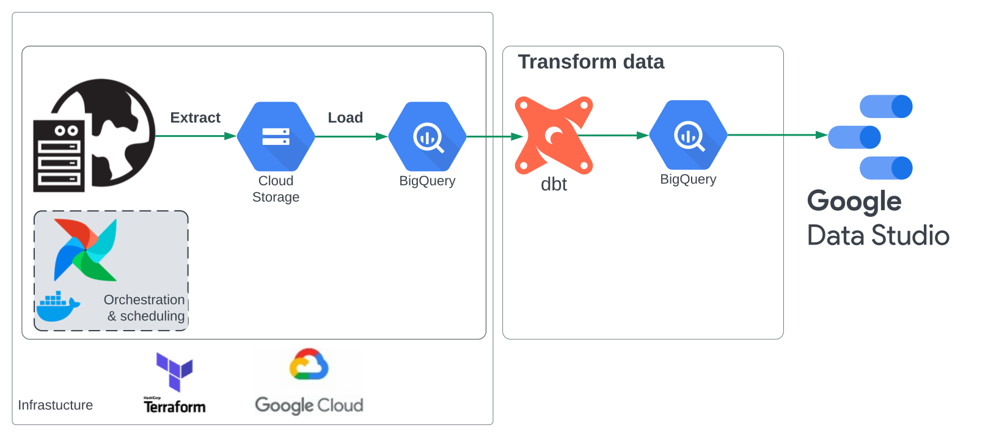
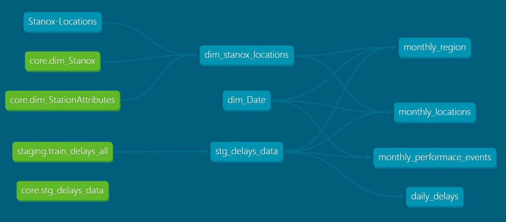
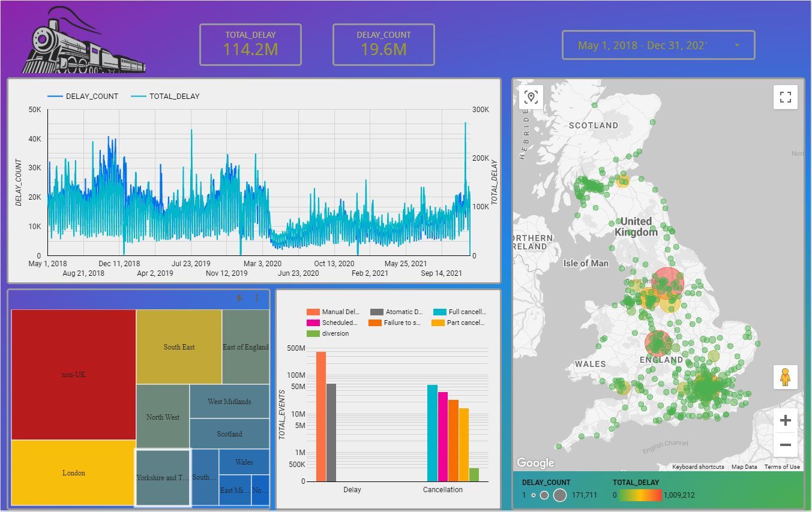

# Analytics of Train Delays of UK Rail

- [Preface](#preface)
- [Introduction](#introduction)
- [Dataset description](#dataset-description)
- [Objective and requirements](#objective-and-requirements)
- [Solution](#solution)
    - [Technology stack](#technologies)
    - [Infrastructure as a code](#iac)
    - [Data pipeline orchestration and scheduling](#orchestration)
    - [Data modelling](#datamodelling)
    - [Reporting](#report)
- [Future development](#todo)

## Preface

This repository contains the final project for the [Data Engineering Zoomcamp](https://github.com/DataTalksClub/data-engineering-zoomcamp) - a free course organized by the [DataTalks.Club](https://datatalks.club) community.
Course tutors: [Victoria Perez Mola](https://linkedin.com/in/victoriaperezmola), [Sejal Vaidya](https://linkedin.com/in/vaidyasejal), [Ankush Khanna](https://linkedin.com/in/ankushkhanna2), [Alexey Grigorev](https://linkedin.com/in/agrigorev). The project covers main data engineering skills taught in the course: Infrastructure as code, containerization, data lake, ETL/ELT, pipeline orchestration and scheduling, batch processing, data warehousing, reporting.

## Introduction

It was initially intended that the data set would consist of multiple file with record count at least on a level of thousands. Thus, a monthly load can be simulated with an amount of data high enough to consider ELT instead of ETL. After thorough review of the available free data sets, UK passenger train delays data set from NetwokRail was chosen https://www.networkrail.co.uk/who-we-are/transparency-and-ethics/transparency/open-data-feeds/.

## Dataset description

There are two types of data in the dataset - ziped csv files, containing delays in minutes with the attribute codes, and a xlsx file with attribute glossary.

### Historic delay files

Comma-separated files containing attribute codes (strings and integers), date/datetime attributes and delay values (float). Each file covers delays over 28/29 day span, leading to 13 files per two-year period: e.g. 2020/21 covers 13 periods starting on 1. April 2020 (encoded as 2020/21_P1) and ending on 31 March 2021 (encoded as 2020/21_P13).

__Key attributes:__
- EVENT_DATETIME - date and time when the event leading to the delay happened. Either in DD-MMM-YYYY HH:mm (e.g. 11-NOV-2018 17:53) or DD/MM/YYYY HH:mm (e.g. 08/12/2019 13:43) format.
- INCIDENT_NUMBER - number of the incident (forms unique identifier together with EVENT_DATETIME)
- PERFORMANCE_EVENT_CODE - Whether the train has been delayed or cancelled. A and M denote delays, C – is a full cancelletion, D is a diversion, F is a failure to stop, S is a scheduled cancellation and O/P are part cancellations
- START_STANOX/END_STANOX - the location of the delay (not the incident)
- RESPONSIBLE_MANAGER - who within the industry is responsible for the delay
- OPERATOR_AFFECTED - code of the cmpany that operates the delayed train
- INCIDENT_REASON - the Delay Attribution Guide cause code for the incident

__IMPORTANT__:
Delay files have schema and date/datetime representation changing.

### Historic-Delay-Attribution-Glossary
xlsx file containing sheets with attribute glossary:
- Stanox Codes
- Period Dates
- Incident Reason
- Responsible Manager
- Reactionary Reason Code
- Performance Event Code
- Service Group Code
- Operator Name
- Train Service Code

## Objective and requirements

Develop end-to-end data solution to perform advanced analysis of the train delays. Solution must meet the following requirements:
- Infrastructure provided via code (IaC approach)
- Cloud storage - data lake and data warehouse
- Create sperate pipelines for historic data and attributes. Historic data pipeline must run every month, pipeline that ingests attributes will be triggered ad-hoc.
- Data transformations must be performed using software engineering principles (data documentation, testing) and in the way that data analysts can easily understand and modify transformations.
- Create interactive report.

## Solution

  

### Technology stack

- Data ingestion pipeline: Apache Airflow
- Data stores: Google Cloud Storage (data lake), Google BigQuery (DWH)
- Data transformation: dbt cloud
- Reporting: Google Data Studio

### Infrastructure as a code

Google Cloud infrastructure is provisioned with Terraform using IaC approach. Google storage bucket, BigQuery data set as well as landing tables for historical and attribute data are defined in [01-terraform/].

### Data pipeline orchestration and scheduling

Initial ingestion of the historical data is done using dockerized Apache Airflow running on a Linux host. Files, stored in *zip format on a web server are saved into a local folder, unzipped, converted into *parquet format, forcing all STRING data type to all columns. The latter is done to speedup the load process and to avoid type errors loading into BigQuery tables. Parquet files are trasfered to Google Cloud storage and a temporal external table is created. The table's content is appended to the landing table with an addition of insert_datetime column for later version control. Finally, a clean-up of the local folder is done. __Important__ the historical data files have changing name and order of the columns, different SQL queries are used to append data from different time periods.

The pipeline is scheduled to rung every month, the corresponding download links are stored in a json file.

### Data modelling

Data modelling is done in dbt cloud. dbt allows to use software engineering approaches for data modelling. It offers native tools for testing and documentation; data infrastructure (DWH schemas, tables, views) is created automatically. On the other hand, data transformation is done using SQL, lowering thus entry threshold. All artifacts are stored in a git repository allowing version control and distributed development.

In the current project dbt cloud is used to stage historical delays data ([03-dbt/staging]): the landing table records are filtered on the latest insert_datetime value, type casting is done. An additional source of train station attributes is loaded is a seed to [03-dbt/seeds]. In the core of the solution ([03-dbt/core]), station/locations and date dimension tabls are created. The latter was inteded to be used for hierarchical filterring in the reporting tool but was abandoned for the most due to limitations of Google Data Studio. Four data marts are created which aggregate delay times in different groups.

Full data lineage of the dbt project:

  

### Reporting

[Link](https://datastudio.google.com/reporting/ac0fd4aa-faa5-4334-8b2f-f4d42854d1db)

  

